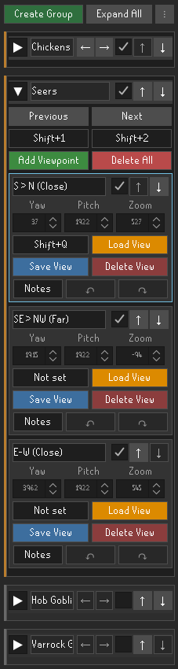
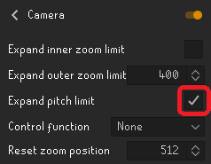
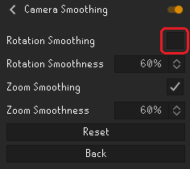

# Camera Scenes

Save and load camera viewpoints so you can quickly return to useful angles.

## Features

- Save camera angles as viewpoints
- Organize viewpoints into groups
- Ability to name, enable, import, export and reorder groups/viewpoints
- Load or cycle through viewpoints with the sidepanel or programmable hotkeys
- Yaw is stored as one of the four compass directions; viewpoint loads briefly use RuneLite's free camera mode while applying saved pitch values

## Screenshots

## Known Issues
- Some plugins that continuously control the camera can override this plugs settings causing instability.
- Loading a viewpoint briefly switches to free camera mode during panning, then returns to attached camera mode automatically. The sidepanel's `...` menu still provides a manual reset if needed.
- Enable **Expand pitch limit** in the **Camera** plugin before using extended values.

- **Camera Smoothing**'s **Rotation Smoothing** can overwrite pitch values, disable it when
needed.

## Support Development

If you find this plugin useful and would like to support its continued development:

- [Sponsor me on GitHub](https://github.com/sponsors/vahnx)
- [Support me through PayPal](https://paypal.me/twitchplaying)

Join the [vahnx Projects Discord](https://discord.gg/bn4HcQWTp) for general support, suggestions, and project discussion.

Thank you for your support!
